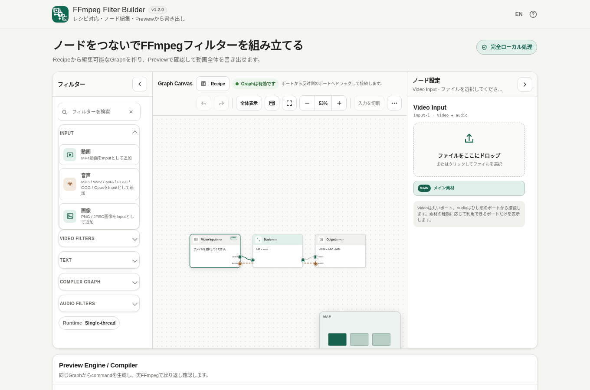

# FFmpeg Filter Builder

[](https://github.com/ttomohisa/htmlapps-ffmpeg-filter-builder/actions/workflows/deploy-pages.yml)
[](LICENSE)
[](https://ttomohisa.github.io/htmlapps-ffmpeg-filter-builder/)

[English README](README.md)

MP4動画のFFmpeg Filter Graphをブラウザー上で組み立てるツールです。Video / Audio / Textの処理を編集可能なNodeとして構成し、内蔵FFmpeg WebAssemblyでPreviewし、そのまま動画全体を書き出せます。選択した動画をアプリからサーバーへアップロードしません。



> 現在の正式版: **v1.2.1**。Multiple Input、PiP、Logo Overlay、BGM / Audio Mix、Graph Restore / Auto Relink、PC / スマートフォン向けGraph Workspace、ST / MT単一HTMLを含むStable版です。

## 🚀 Live demo

### [GitHub PagesでFFmpeg Filter Builderを開く](https://ttomohisa.github.io/htmlapps-ffmpeg-filter-builder/)

標準Single-thread版: https://ttomohisa.github.io/htmlapps-ffmpeg-filter-builder/  
高速Multi-thread版: https://ttomohisa.github.io/htmlapps-ffmpeg-filter-builder/mt/

GitHub Pagesから最初のHTMLを読み込んだ後、選択したMP4、Graph、Preview、Full Renderの処理はブラウザー内で行います。アプリから選択した動画をサーバーへアップロードしません。`/mt/` は、配信元がCOOP / COEP headerを付けていない場合だけ、同一originの `coi-serviceworker` を補助として使用します。

## Features

- **Recipeから始めてもGraphを直接作っても使える** — 24種類のRecipeはブラックボックスではなく、通常の編集可能なNode / Edgeへ展開されます。
- **Graph Canvasを中心に編集** — Pan / Zoom / Fit、Node自由配置、複数選択、双方向drag-to-connect、MiniMapを備えたNode EditorとしてGraphを操作できます。
- **よく使うVideo filterをGUIで編集** — Trim、Speed、FPS、Scale、Crop、Pad、Rotate、Flip、Aspect Ratio、Color Adjust、Hue、Blur、Sharpen、Fadeに対応します。
- **分岐・合流Graphを構築** — Split / Overlayを使い、Picture in Pictureや背景ぼかしのようなbranch / merge構成を作れます。
- **Audioも同じGraphで処理** — Audio Trim、Volume、Fade、Speed、High-pass、Low-pass、Normalize、Split、Mixに対応し、Video Speed時の音声同期に加えて外部Audio InputからBGM追加・音声置き換えもできます。
- **日本語・英語の文字を重ねる** — Draw Textは内蔵M PLUS 1p Regularを使い、位置、色、背景、余白、表示時間を設定できます。
- **PreviewとFull Renderで同じGraphを使用** — Previewだけ処理範囲を限定し、Full Renderでは同じGraphを入力動画全体へ適用します。
- **Graphプロジェクトを保存・復元** — Graph JSONの保存 / 読み込みと端末内Autosaveに対応します。素材本体や絶対パスは保存せず、復元後は元ファイルをまとめて選ぶと一致するInputへ自動再関連付けします。
- **複数素材Inputを編集** — MP4動画・音声・PNG / JPEG画像を個別のInput Nodeとして追加し、ファイル変更・解除やCanvasへのDropができます。複数InputのPreview / Full RenderはBuilder v1.10.2で実行します。
- **Desktop FFmpeg commandを生成** — 現在のGraphをコピー可能なFFmpegコマンドへコンパイルできます。
- **Single-thread / Multi-thread版** — 標準版は`file://`から直接利用でき、高速版はHTTP(S) + cross-origin isolationを前提とします。
- **完全ローカル処理** — 生成HTMLにはFFmpeg WASMと標準フォントを埋め込み、runtime CSPは`connect-src 'none'`です。

## Quick start

### Web版を使う

[GitHub Pages版](https://ttomohisa.github.io/htmlapps-ffmpeg-filter-builder/)を開き、MP4を読み込み、Recipeを選んでPreviewし、最後に動画を書き出します。登録やインストールは不要です。

### Windowsで単一HTMLを作る

1. このリポジトリをダウンロードまたはcloneします。
2. `build-standalone.bat`をダブルクリックするか、コマンドプロンプトから実行します。
3. 初回buildでは固定済みのFFmpeg WASM runtimeとM PLUS 1p font snapshotを取得して検証します。
4. 標準Single-thread版はルート直下の`ffmpeg-filter-builder.html`です。内容は`dist/index.html`と完全に同一です。
5. Multi-thread版は`ffmpeg-filter-builder.mt.html`で、`dist/index.mt.html`と完全に同一です。

通常のアプリbuild自体にNode.jsは必要ありません。Windows PowerShellでbuildします。

## Usage

1. **Recipe**からやりたい処理を選ぶか、Input NodeからMP4を読み込みます。サイズや長さが必要なRecipeは、**動画を選んでGraphへ展開**からそのままMP4を選べます。
2. RecipeをGraphへ展開するか、Filter Nodeを直接追加します。
3. Nodeを選択して設定を変更します。Video / Audioの対応するportを接続して処理順を組み替えられます。
4. **Preview**で3秒 / 5秒 / 10秒の範囲を確認します。動画全体を毎回処理する必要はありません。
5. 問題なければ**動画を書き出す**で、同じGraphを入力動画全体へ適用します。
6. 生成されたH.264 + AAC MP4を確認し、必要ならファイル名を変更して保存します。

### Recipes

現在は24種類です。

- **サイズ・向き** — 720pへ縮小、1080pへ縮小、正方形Crop、縦動画、背景ぼかし縦動画、16:9横動画、背景ぼかし正方形、90°回転、左右反転、30fps
- **合成・見た目** — Fade In / Out、Watermark、ロゴを重ねる、Picture in Picture、中央タイトル、モノクロ、少しシャープ
- **時間・音声** — 最初の10秒、0.5倍速、1.5倍速、2倍速、Audio Normalize、BGMを追加、音声をBGMに置き換える

入力サイズや動画長に依存するRecipeでも、事前に動画を読み込む必要はありません。Recipeを選んで**動画を選んでGraphへ展開**を押すと、その場でMP4を選び、サイズ・長さに合わせたGraphを生成します。

### Graph操作

**Graph操作**はFFmpeg filterではなく、Graph自体を管理するための補助操作です。

- Graph JSONを保存
- Graph JSONを開く
- Missing Inputがある場合は**素材をまとめて再選択**
- Graph初期化（確認ダイアログあり）

Undo / RedoはGraph Toolbarから直接操作できます。旧バージョンにあったSplit + Overlay / Audio MixのサンプルGraphショートカットは、Recipeと役割が重なるため利用者向けメニューから削除しました。Video filters、Text、Complex graph、Audio filtersはPalette内で利用できます。

### スマートフォンでのGraph編集

ノードを1回タップするかEnter / Spaceで設定を開きます。ノードを残して入力接続を外すには **その他 → 入力を切断** を使い、戻す場合はUndoを押します。PCの浮動Canvasからスマートフォン幅に切り替えると浮動表示を解除します。

スマートフォンではGraph Canvasを横幅いっぱいに表示し、主要操作を下部固定の **レシピ / 追加 / 戻す / その他 / プレビュー** にまとめます。FFmpeg Filter BuilderではRecipeを主導線として扱い、**レシピ**を押すと24種類を **サイズ・向き / 合成・見た目 / 時間・音声** に分けたタップカードのBottom Sheetを開きます。Recipeを選ぶと説明を確認でき、そのまま固定アクションから編集可能なGraphへ展開できます。

**追加**はFilter PaletteをBottom Sheetで開きます。**その他**には全体表示、やり直し、Graph JSON、素材の再選択、初期化をまとめ、横スクロールするToolbarはスマートフォンでは表示しません。Nodeは1回TapするとNode Inspectorが開きます。FilterやInputを追加した直後もそのNodeの設定へ進み、設定後は右上の**完了**でCanvasへ戻れます。削除などNode自体への操作は通常の設定とは分けて表示します。Canvasは1本指でPan、NodeをDragして移動でき、2本指のPinchでZoomできます。PortはDrag接続に加えて、開始Portと接続先Portを順にTapしても接続できます。

### Graph JSON / Autosave

**Graph JSONを保存**で編集可能なGraphプロジェクトを書き出し、**Graph JSONを読み込む**で復元できます。

Autosaveが保存するのはGraph、Inputの素材メタデータ、出力ファイル名だけです。素材ファイル本体や絶対パス、生成動画は保存しません。復元後に**素材をまとめて再選択**すると、ファイル名とサイズが一致するMissing Inputへ自動で再関連付けします。Canvasへ複数ファイルをドロップした場合も、まず一致するMissing Inputへ再関連付けし、残りだけを新しいInputとして追加します。

## 現在のruntime（v1.2.1）

標準ビルドは公開済みBuilder v1.10.2のST/MT資産へ固定し、動画の最終フレームの長さと範囲指定Previewのタイミングを修正します。対応codec・Graph schema・GPL runtimeライセンス・ローカル処理の境界は変更しません。以下のバージョン別セクションは過去のリリース記録です。[runtime検証記録](docs/BUILDER_V1_10_2_RELEASE.md)を参照してください。

## v1.2.0 Stable

v1.2.0は、beta.4 / rc.1の機能を全体回帰後にStableへ確定した正式版です。Single Input、Multiple Video Input、Image Input、Audio Input、PiP、Logo Overlay、BGM / Audio Mix、Draw Text、Trim / Speed、Preview / Full Render、24種類のRecipe、Graph JSON、Auto Relink、Autosave、Undo / Redo、キーボード操作、PC / Mobile、ST / MT、`file://`、cross-origin isolation、CSP、runtime外部通信禁止を含みます。

Stable化にあたり新しいruntime依存は追加していません。FFmpeg WASM Builderは引き続きv1.9.9固定で、生成するstandalone HTMLも`connect-src 'none'`を維持します。

## v1.2.0-beta.4 Graph Restore / Auto Relink

v1.2.0-beta.4では、Graph JSONやAutosaveから復元したときのMissing Input再設定を改善しました。Graphには従来どおり素材ファイル本体やローカルの絶対パスを保存せず、`filename / size / type / lastModified`などのメタデータだけを保持します。

Missing Inputが複数ある場合、Graph操作の**素材をまとめて再選択**から元ファイルを複数選択できます。ファイル名とサイズが一致するInputへ自動で再関連付けし、`lastModified`とMIME typeは一致候補の優先度に使います。現在のセッションですでに同じ素材を読み込んでいる場合は、Graph JSONを開いた時点で再利用できる素材を自動で戻します。

CanvasへのファイルDropも同じ照合を先に行います。一致するMissing Inputは復元し、一致しない対応ファイルだけを新しいInputとして追加します。明示的に1つのMissing InputへファイルをDrop / 選択した場合は、従来どおりそのInputへ直接割り当てられます。

## v1.2.0-beta.3 Audio Input / BGM / Audio Mix

v1.2.0-beta.3では、外部Audio Inputを単にGraphへ置けるだけでなく、動画用途として最後まで使えるようにしました。**BGMを追加**はMain動画 + Audio Input + Audio Mixを作り、BGMを既定で-12 dBにします。**音声をBGMに置き換える**はMain動画の元音声を使わず、選択したAudio Inputを出力音声にします。Main動画が無音の場合も、存在しない`[0:a]`を参照せずBGMだけを使用します。

Audio Mixの直前で両入力を48 kHzへ揃え、timestampを0から合わせます。Audio Mixには「Aに合わせる / 短い方 / 長い方」の長さ基準を追加しました。BGM Recipeでは音声の長い方までMixしてから最終音声をMain動画の長さで切るため、Main音声が短くてもBGMを途中で切らず、長いBGMを選んでも動画の書き出し時間は延長しません。sample rateの違いや通常のmono / stereo差はFFmpegのaudio resample経路で扱います。

BGM / 置き換え用ファイルも通常のローカルAudio Inputです。対応するAudio InputはMP3 / WAV / M4A / FLAC / OGG / Opusです。固定済みruntimeにraw AAC demuxerがないため、`.aac`単体は選択対象に含めません。未選択ならMissing Audio Inputを作るため、あとから割り当てられます。PreviewとFull Renderは同じmulti-input Graphを、固定済みBuilder v1.9.9 runtimeで処理します。

## v1.2.0-beta.2 Image Input / Logo Overlay

v1.2.0-beta.2では、Image Inputを実用的なロゴ重ねとして使えるようにしました。新しい**ロゴを重ねる**Recipeは、`Main Video → Overlay` と `Image Input → Scale → Overlay` を作り、AudioはMain Inputからそのまま出力します。画像がまだ選ばれていない場合はMissing Image Inputを作成して選択するため、次に何をすればよいか分かる状態を維持します。

Image Inputは、現在のBuilder v1.9.9 runtimeで確認している **PNG / JPEG** に限定しました。Overlay Inspectorには**前景の表示を維持**を追加し、Logo RecipeではONにします。これにより静止画が1フレームでEOFになってもMain Inputの最後まで表示を続けます。通常の2動画PiPではOFFのため、前景動画が先に終わった場合は最終フレームを固めずPiPだけ消えます。

`runtime.lock.json`は公開済みのFFmpeg WASM Builder **v1.9.9** ST / MT GitHub Release assetとSHA-256へ更新しました。GitHubへのアクセスはstandalone build時だけで、生成HTMLにはFFmpeg WASMを埋め込み、実行時は従来どおり`connect-src 'none'`です。

Graph JSON / Autosaveにはローカルpathや素材本体を保存しません。復元時は素材ファイルをもう一度選択します。

## Browser support

主要対象はChrome / Edgeです。標準Single-thread版は`file://`で直接開いて使える構成です。Multi-thread版はcross-origin isolationと`SharedArrayBuffer`に対応したブラウザーおよびHTTP(S)配信が必要です。Firefox / Safariでは一部機能が動く可能性がありますが、v1.2.0でもChrome / Edgeを主要対象とします。

## 標準版 / Multi-thread版

| Build | ファイル | 実行方法 | 用途 |
| --- | --- | --- | --- |
| 標準版 | `dist/index.html` | `file://` またはHTTP(S) | Single-thread。持ち運べる単一HTML版 |
| 高速版 | `dist/index.mt.html` | COOP / COEP付きHTTP(S) | `SharedArrayBuffer`を使うMulti-thread版 |

WindowsでMulti-thread版をローカル確認する場合:

```bat
start-local-mt.bat
```

このローカルサーバーはcross-origin isolationに必要なheaderを付けます。

## GitHub Pagesで公開する

リポジトリにはST / MTのstandalone buildと、GitHub Pages専用の配信ディレクトリを作るGitHub Actions workflowが含まれています。

1. `ttomohisa/htmlapps-ffmpeg-filter-builder`としてpushします。
2. **Settings → Pages → Build and deployment → Source** で **GitHub Actions** を選択します。
3. `main`へpushするか、Actionsから **Deploy standalone app to GitHub Pages** を手動実行します。
4. 標準版は`https://ttomohisa.github.io/htmlapps-ffmpeg-filter-builder/`で利用できます。
5. Multi-thread版は`https://ttomohisa.github.io/htmlapps-ffmpeg-filter-builder/mt/`で利用できます。

`dist/index.mt.html` 自体は従来どおり単一HTMLのまま保持し、Pages配信用にだけ `pages-dist/mt/index.html` を生成します。GitHub PagesではCOOP / COEPを直接設定できないため、この配信用HTMLだけが必要時に同一originの `coi-serviceworker` を読み込みます。Azure Static Web Appsなどでサーバー側headerにより `crossOriginIsolated === true` になっている場合、このfallback workerは読み込まれません。

## 開発・build構成

```text
.
├─ src/index.template.html       # アプリ本体template
├─ app.config.json               # アプリ情報 / build設定
├─ runtime.lock.json             # FFmpeg WASM Builder releaseの固定情報
├─ font.lock.json                # M PLUS 1p font snapshotの固定情報
├─ build-standalone.bat          # Windows build入口
├─ build-standalone.ps1          # ST / MT standalone builder
├─ ffmpeg-filter-builder.html     # dist/index.htmlと同一の生成ST版
├─ ffmpeg-filter-builder.mt.html  # dist/index.mt.htmlと同一の生成MT版
├─ scripts/                      # runtime準備・検証・repository check
├─ tests/                        # Graph / Preview / Filter / Recipe / Pages smoke test
├─ vendor/coi-serviceworker/     # GitHub Pages専用COI fallback（固定版）
├─ dist/                         # 生成されるstandalone成果物
└─ pages-dist/                   # GitHub Pages配信用の生成ディレクトリ
```

通常build:

```bat
build-standalone.bat
```

固定済みbuild inputを再取得:

```powershell
.\build-standalone.ps1 -ForceDownload
```

FFmpeg WASM Builder開発時だけ、ローカルruntimeを指定できます。ローカル統合はBuilder v1.9.8 / v1.9.9 / v1.10.2を受け付け、v1.9.9 / v1.10.2では`multipleInputs` + `complexGraph`と`null` / `anull`を確認してから埋め込みます。

```bat
build-with-local-ffmpeg.bat C:\path\to\htmlapps-ffmpeg-wasm-builder
```

buildではST / MTそれぞれの通常版・self-extract版HTMLとruntime / size manifestを生成し、最後にルート直下のST / MT単一HTMLも更新してSHA-256一致を確認します。

## Privacy / Runtime network protection

選択した動画、Graph、Draw Text内容、Preview結果、Full Render結果はブラウザー内で処理します。

生成されるアプリには以下を内蔵します。

- FFmpeg WebAssembly runtime
- M PLUS 1p Regular
- runtime Content Security Policyの`connect-src 'none'`
- GitHub / Google Fonts / CDNへの実行時依存なし

GitHub Pages版そのものを最初に開く通信と、ソースから初回buildするときの依存取得にはネットワークが必要です。完全にオフラインで使う場合は、一度buildした標準版`ffmpeg-filter-builder.html`（または同一内容の`dist/index.html`）をローカルで開いてください。

## Limitations

- デフォルトruntimeはBuilder v1.10.2 GitHub Releaseへ固定済みです。複数のVideo / Audio / Image InputをPreview / Full Renderで実行できます。
- 出力形式はH.264 video + AAC audioのMP4です。
- Multiple Input実行には`multipleInputs`と`complexGraph`を広告するruntimeが必要です。復元したprojectではローカル素材の再選択も必要です。
- ブラウザー内で動画全体を再エンコードするため、長時間・高解像度動画ではCPU負荷とメモリ使用量が大きくなります。
- Multi-thread版は`file://`から直接実行できません。COOP / COEPと`SharedArrayBuffer`を利用できるHTTP(S)環境が必要です。
- MP4 containerを選択できても、内部codecや端末メモリの制約で処理できない場合があります。

## Embedded build inputs

| Component | Version / snapshot | License | 用途 |
| --- | --- | --- | --- |
| FFmpeg WASM Builder | v1.10.2 / `ffmpeg-filter-builder` profile | 生成runtime manifest / Third-party notices参照 | FFmpeg WebAssembly runtime、H.264/AAC処理、Filter |
| M PLUS 1p Regular | 固定Google Fonts snapshot | OFL-1.1 | Draw Text用の日本語 / 英語font |

ソースパッケージにはfont binaryをcommitしません。build時だけ`font.lock.json`に固定したsnapshotを取得・検証し、生成standalone HTMLへ埋め込みます。詳細は[THIRD_PARTY_NOTICES.md](THIRD_PARTY_NOTICES.md)を参照してください。

## Contributing

不具合報告や機能提案はGitHub Issuesで受け付けます。開発時の注意事項は[CONTRIBUTING.md](CONTRIBUTING.md)を参照してください。

## License

Copyright © 2026 ttomohisa

[MIT License](LICENSE)で公開しています。
