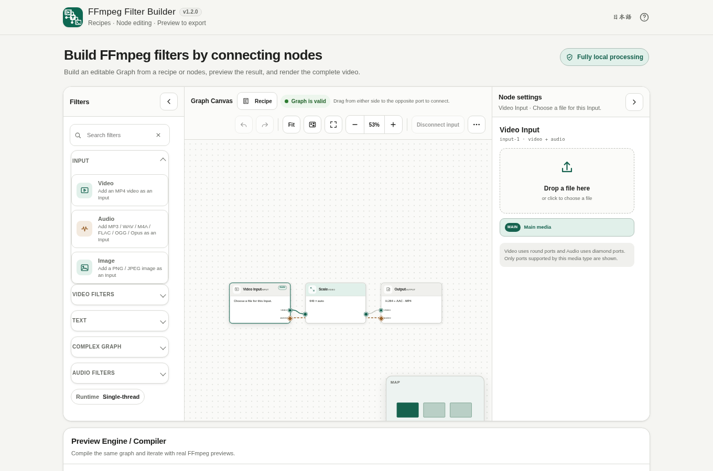

# FFmpeg Filter Builder

[](https://github.com/ttomohisa/htmlapps-ffmpeg-filter-builder/actions/workflows/deploy-pages.yml)
[](LICENSE)
[](https://ttomohisa.github.io/htmlapps-ffmpeg-filter-builder/)

[日本語版 README](README.ja.md)

A browser-based FFmpeg filter graph editor for MP4 video. Build Video / Audio / Text processing as editable nodes, preview the result with embedded FFmpeg WebAssembly, and render the complete video without uploading the selected file to a server.



> Current release: **v1.2.3**. This stable release includes Multiple Input, PiP, Logo Overlay, BGM / Audio Mix, Graph Restore / Auto Relink, the desktop/mobile Graph Workspace, and ST / MT standalone builds.

## 🚀 Live demo

### [Open FFmpeg Filter Builder on GitHub Pages](https://ttomohisa.github.io/htmlapps-ffmpeg-filter-builder/)

GitHub Pages delivers the initial HTML. After the page loads, the selected MP4, Graph, Preview, and Full Render processing stay in the browser. The app does not upload the selected media file.

## Features

- **Start from a recipe or build the Graph yourself** — Twenty-four recipes expand into normal editable nodes and edges instead of hiding the processing behind a preset.
- **Edit around the Graph Canvas** — Pan / zoom / fit, manual node layout, multi-selection, bidirectional drag-to-connect, and a MiniMap make the Graph behave like a dedicated node editor.
- **Edit common video filters visually** — Trim, Speed, FPS, Scale, Crop, Pad, Rotate, Flip, Aspect Ratio, Color Adjust, Hue, Blur, Sharpen, and Fade.
- **Build branching video graphs** — Split and Overlay support branch / merge layouts such as Picture in Picture and blurred-background video.
- **Process audio in the same Graph** — Audio Trim, Volume, Fade, Speed, High-pass, Low-pass, Normalize, Split, and Mix are available, including synchronized audio for Video Speed and external Audio Input for BGM / soundtrack replacement.
- **Add Japanese or English text** — Draw Text uses the embedded M PLUS 1p Regular font and supports position, color, background, padding, and display timing.
- **Preview and render with the same Graph** — Preview uses a bounded range; Full Render removes the preview range and processes the complete input.
- **Save and restore Graph projects** — Export/import Graph JSON and optionally restore the last Graph from browser-local autosave. Media bytes and absolute paths are not stored; after restore, bulk-select the original files and matching Missing Inputs are re-linked automatically.
- **Manage multiple media Inputs** — Add MP4 video, audio, and PNG / JPEG image files as separate Input nodes, replace or detach their files, and drop media directly onto the Canvas. Multiple Input Preview / Full Render runs with Builder v1.10.2.
- **Generate a desktop FFmpeg command** — The current Graph can also be compiled into a copyable desktop command.
- **Single-thread and multi-thread builds** — The standard build supports direct `file://` use. The multi-thread build requires cross-origin isolation over HTTP(S).
- **Fully local runtime processing** — FFmpeg WASM and the standard font are embedded into the generated HTML. Runtime CSP uses `connect-src 'none'`.

## Quick start

### Use the web demo

Open the [GitHub Pages demo](https://ttomohisa.github.io/htmlapps-ffmpeg-filter-builder/), load an MP4, choose a recipe, preview it, and render the output. No account or installation is required.

### Build the standalone HTML on Windows

1. Download or clone this repository.
2. Double-click `build-standalone.bat` or run it from Command Prompt.
3. The first build downloads and verifies the pinned FFmpeg WASM runtime and M PLUS 1p font snapshot.
4. Open the root-level `ffmpeg-filter-builder.html` for the standard single-thread build. It is byte-identical to `dist/index.html`.
5. The root-level `ffmpeg-filter-builder.mt.html` is the matching multi-thread build and is byte-identical to `dist/index.mt.html`.

The normal build uses Windows PowerShell and does not require Node.js for the application build itself.

## Usage

Help and Reset keep the page behind them still. On short screens, scroll inside the dialog to reach the last item or Reset action. Closing the mobile Palette returns keyboard focus to Add; Inspector Done returns it to the selected visible node. Reset cancellation returns it to Graph tools (More on mobile).

1. Choose a task from **Recipes** or load an MP4 from the Input node. Recipes that need source dimensions or duration offer **Choose video & build graph**, so you can select the MP4 in the same step.
2. Build the recipe graph or add filter nodes manually.
3. Select a node to edit its settings. Connect compatible Video and Audio ports to change the processing order.
4. Use **Preview** to check a 3, 5, or 10 second range without rendering the whole file.
5. When the result looks correct, use **Full Render** to apply the same Graph to the complete video.
6. Review the generated H.264 + AAC MP4, edit the output filename if necessary, and save it.

### Recipes

The current recipe set contains 24 recipes:

- **Size & orientation** — Resize to 720p, Resize to 1080p, Square Crop, Vertical Video, Blur Background Vertical, 16:9 Landscape, Blur Background Square, Rotate 90°, Mirror Horizontally, Convert to 30 fps
- **Composite & look** — Fade In / Out, Watermark, Logo Overlay, Picture in Picture, Centered Title, Grayscale, Light Sharpen
- **Time & audio** — Keep First 10 Seconds, 0.5x Speed, 1.5x Speed, 2x Speed, Audio Normalize, Add BGM, Replace Audio with BGM

Recipes that depend on source dimensions or duration no longer require pre-loading the video. Select the recipe and use **Choose video & build graph** to pick the MP4 and generate source-aware node settings in one step.

### Graph tools

**Graph tools** contains project-level operations rather than FFmpeg filters:

- Save Graph JSON
- Open Graph JSON
- **Re-select media in bulk** when Missing Inputs exist
- Reset Graph with confirmation

Undo / Redo remain directly available in the Graph toolbar. The legacy Split + Overlay and Audio Mix sample shortcuts were removed from the user-facing menu because Recipes now cover the guided starting flow. Video filters, Text, Complex graph, and Audio filters remain available in the Palette.

### Mobile Graph editing

Tap a node once, or activate it with Enter / Space, to open its Inspector. To remove its incoming connections without deleting the node, use **More → Disconnect input**; Undo restores them. Moving from a floating desktop Canvas to smartphone width exits floating mode.

On smartphones, the Graph Canvas uses the available width and the main controls move to a fixed bottom action bar: **Recipe / Add / Undo / More / Preview**. Recipe is intentionally first-class: tapping it opens a dedicated bottom sheet with all 24 recipes grouped into **Size & orientation / Composite & look / Time & audio** cards. Select a card, review its description, then expand it into the editable Graph from the sticky action area.

**Add** opens the Filter Palette as a bottom sheet. **More** keeps Fit, Redo, Graph JSON, re-link, and reset actions reachable without a horizontally scrolling toolbar. Tap a node once to open its Node Inspector. Newly added filter or Input nodes move directly into settings, and the Inspector uses a clear **Done** action to return to the Canvas. Destructive node actions are separated from normal settings. Drag one finger on the Canvas to pan, drag a node to move it, and use a two-finger pinch to zoom. Ports can be connected either by dragging a wire or by tapping the start and destination ports in sequence.

### Graph JSON and autosave

**Save Graph JSON** exports the editable Graph project. **Load Graph JSON** restores it later.

Autosave stores the Graph, Input media metadata, and output filename in this browser's local storage. It does not store media bytes, absolute local paths, or rendered output. After restore, use **Re-select media in bulk** to choose the original files; matching filename and size are used to re-link Missing Inputs automatically. Dropping several files on the Canvas performs the same matching first, then adds only unmatched supported files as new Inputs.

## Current runtime (v1.2.3)

The default build pins the published Builder v1.10.2 ST/MT assets, correcting terminal video-frame duration and bounded-preview timing. Codec/catalog, graph schema, GPL runtime licensing, and offline boundaries are unchanged. The versioned sections below preserve earlier release history. See [runtime release verification](docs/BUILDER_V1_10_2_RELEASE.md).

## v1.2.0 Stable

v1.2.0 promotes the beta.4 / rc.1 codebase to Stable after the full release regression. It includes Single Input, Multiple Video Input, Image Input, Audio Input, PiP, Logo Overlay, BGM / Audio Mix, Draw Text, Trim / Speed, Preview / Full Render, 24 Recipes, Graph JSON, Auto Relink, Autosave, Undo / Redo, keyboard editing, desktop/mobile UI, ST / MT, `file://`, cross-origin isolation, CSP, and runtime-network blocking.

Stable adds no new runtime dependency. FFmpeg WASM Builder remains pinned to v1.9.9 and the generated standalone HTML keeps `connect-src 'none'`.

## v1.2.0-beta.4 Graph Restore / Auto Relink

v1.2.0-beta.4 improves the Missing Input flow after opening Graph JSON or restoring browser-local autosave. The project still never stores media bytes or absolute local paths. It keeps only metadata such as `filename / size / type / lastModified`.

When several Inputs are missing, **Re-select media in bulk** lets you choose the original files together. Files are matched to Missing Inputs by media kind, filename, and size; `lastModified` and MIME type are used to prefer the strongest match. If matching media is already loaded in the current session, opening a Graph can reuse those File objects immediately without another picker round-trip.

Canvas file drop uses the same matching step first. Matching files restore Missing Inputs, while remaining supported files are added as new Inputs. Explicitly choosing or dropping one file onto a specific Missing Input still binds directly to that Input.

## v1.2.0-beta.3 Audio Input / BGM / Audio Mix

v1.2.0-beta.3 makes external Audio Input a complete video workflow rather than only a graph primitive. **Add BGM** builds Main Video + Audio Input + Audio Mix, with BGM at -12 dB by default. **Replace Audio with BGM** ignores the Main soundtrack and uses the selected Audio Input instead. If the Main video is silent, Add BGM automatically uses the external audio without referencing a missing `[0:a]` stream.

Before `amix`, both branches are resampled to 48 kHz and their timestamps restart from zero. Audio Mix now lets you choose whether duration follows input A, the shorter input, or the longer input. The BGM recipe keeps the longer audio branch during the mix, then caps the final soundtrack to the Main video duration, so a short Main audio track does not cut off a longer BGM and a long music file still cannot extend the rendered video. Different sample rates and ordinary mono/stereo differences are handled through FFmpeg's audio resampling path.

The BGM / replacement file is still a normal local Audio Input. Supported Audio Input files are MP3, WAV, M4A, FLAC, OGG, and Opus; raw `.aac` is not offered because the pinned runtime does not include the raw AAC demuxer. If it has not been selected yet, the Recipe creates a visible Missing Audio Input that can be filled later. Preview and Full Render use the same compiled multi-input graph with the pinned Builder v1.9.9 runtime.

## v1.2.0-beta.2 Image Input / Logo Overlay

v1.2.0-beta.2 makes Image Input a practical runtime feature for logo overlays. The new **Logo Overlay** recipe builds `Main Video → Overlay` plus `Image Input → Scale → Overlay`, keeps Main Input audio, and selects a visible Missing Image Input when no logo file has been assigned yet.

Image Input is intentionally limited to **PNG / JPEG** because those formats are compiled into the reviewed Builder v1.9.9 runtime. The Overlay Inspector now has **Keep foreground visible**. The Logo recipe enables it so the image remains visible after its single decoded frame reaches EOF; normal two-video PiP keeps it off so a shorter foreground video disappears instead of freezing.

The checked-in `runtime.lock.json` now pins the published Builder **v1.9.9** ST / MT GitHub Release assets and SHA-256 values. GitHub is only contacted while building the standalone HTML. The generated HTML still embeds FFmpeg WASM and keeps runtime `connect-src 'none'`.

Graph JSON / Autosave still stores metadata only, never local media bytes or paths. Restored projects require the source files to be selected again.

## Browser support

Chrome and Edge are the primary supported browsers. The standard single-thread build is intended to work as a directly opened `file://` HTML file. The multi-thread build requires a browser and HTTP(S) deployment that support cross-origin isolation and `SharedArrayBuffer`. Firefox and Safari may work for parts of the app, but Chrome and Edge remain the primary targets for v1.2.0.

## Standard and multi-thread builds

| Build | File | How to run | Notes |
| --- | --- | --- | --- |
| Standard | `dist/index.html` | `file://` or HTTP(S) | Single-thread; portable standalone version |
| Multi-thread | `dist/index.mt.html` | HTTP(S) with COOP / COEP | Uses `SharedArrayBuffer` and requires cross-origin isolation |

For a local multi-thread test on Windows:

```bat
start-local-mt.bat
```

The helper server adds the required cross-origin-isolation headers.

## Publish with GitHub Pages

The repository includes a workflow that builds both standalone variants and stages a Pages-specific site.

1. Push the repository as `ttomohisa/htmlapps-ffmpeg-filter-builder`.
2. Open **Settings → Pages → Build and deployment → Source** and select **GitHub Actions**.
3. Push to `main`, or manually run **Deploy standalone app to GitHub Pages** from the Actions tab.
4. After deployment, the standard build is available at `https://ttomohisa.github.io/htmlapps-ffmpeg-filter-builder/`.
5. The multi-thread build is available at `https://ttomohisa.github.io/htmlapps-ffmpeg-filter-builder/mt/`.

The Pages workflow keeps `dist/index.mt.html` as the standalone MT artifact, then creates `pages-dist/mt/index.html` for hosting. GitHub Pages cannot add the required COOP / COEP headers directly, so only the Pages copy conditionally loads the vendored `coi-serviceworker` fallback. On a host such as Azure Static Web Apps where the response already has the required headers, `crossOriginIsolated` is already true and the fallback worker is not loaded.

## Development and build layout

```text
.
├─ src/index.template.html       # Application template
├─ app.config.json               # App metadata and build settings
├─ runtime.lock.json             # Pinned FFmpeg WASM Builder release assets
├─ font.lock.json                # Pinned M PLUS 1p font snapshot
├─ build-standalone.bat          # Windows build entry point
├─ build-standalone.ps1          # ST / MT standalone builder
├─ ffmpeg-filter-builder.html     # Generated ST copy of dist/index.html
├─ ffmpeg-filter-builder.mt.html  # Generated MT copy of dist/index.mt.html
├─ scripts/                      # Runtime preparation, verification, and repository checks
├─ tests/                        # Graph / Preview / filter / recipe / Pages smoke tests
├─ vendor/coi-serviceworker/     # Pinned GitHub Pages-only COI fallback
├─ dist/                         # Generated standalone artifacts
└─ pages-dist/                   # Generated GitHub Pages staging directory
```

Normal build:

```bat
build-standalone.bat
```

Force the pinned build inputs to be downloaded again:

```powershell
.\build-standalone.ps1 -ForceDownload
```

For FFmpeg WASM Builder development only, the local integration accepts Builder v1.9.8, v1.9.9 and v1.10.2. The v1.9.9 and v1.10.2 runtimes are additionally required to advertise `multipleInputs` + `complexGraph` and include `null` / `anull` before it is embedded:

```bat
build-with-local-ffmpeg.bat C:\path\to\htmlapps-ffmpeg-wasm-builder
```

The normal build consumes the reviewed v1.10.2 lock directly. See `docs/BUILDER_V1_10_2_RELEASE.md` for exact release provenance and hashes. The older v1.9.9 promotion script is historical and must not be run for this release. The build produces both readable and self-extracting ST / MT standalone HTML variants together with runtime and size manifests, then refreshes the root-level ST / MT standalone copies and verifies them by SHA-256.

## Privacy and runtime network protection

The selected video, Graph data, Draw Text content, Preview output, and Full Render output are processed locally in the browser.

The generated application includes:

- embedded FFmpeg WebAssembly runtime
- embedded M PLUS 1p Regular font
- `connect-src 'none'` in its runtime Content Security Policy
- no runtime dependency on GitHub, Google Fonts, or a CDN

Network access is required when using the hosted GitHub Pages page itself and when building from source for the first time. For use with the network disconnected, open the generated standard `ffmpeg-filter-builder.html` (or the identical `dist/index.html`) locally after building it.

## Limitations

- The checked-in runtime lock pins Builder v1.10.2 from GitHub Release. Local Builder integration remains available only for runtime development and verification.
- Output is H.264 video + AAC audio in MP4.
- Multi-input execution requires a runtime that advertises `multipleInputs` and `complexGraph`; restored projects still require local source files to be re-selected.
- Full browser-side transcoding can use substantial CPU time and memory, especially for long or high-resolution videos.
- The multi-thread build cannot run directly from `file://`; it requires HTTP(S) with COOP / COEP and `SharedArrayBuffer` support.
- Browser codec and memory limits can prevent some MP4 files from being processed even when the container format is accepted.

## Embedded build inputs

| Component | Version / snapshot | License | Purpose |
| --- | --- | --- | --- |
| FFmpeg WASM Builder | v1.10.2 / `ffmpeg-filter-builder` profile | See generated runtime manifest and third-party notices | FFmpeg WebAssembly runtime, H.264/AAC processing, filters |
| M PLUS 1p Regular | pinned Google Fonts snapshot | OFL-1.1 | Draw Text font for Japanese / English text |

The source package does not commit the font binary. It is fetched only during the build, verified against `font.lock.json`, and embedded into generated standalone HTML. See [THIRD_PARTY_NOTICES.md](THIRD_PARTY_NOTICES.md) for details.

## Contributing

Bug reports and feature proposals are welcome through GitHub Issues. See [CONTRIBUTING.md](CONTRIBUTING.md) for development guidance.

## License

Copyright © 2026 ttomohisa

Licensed under the [MIT License](LICENSE).
